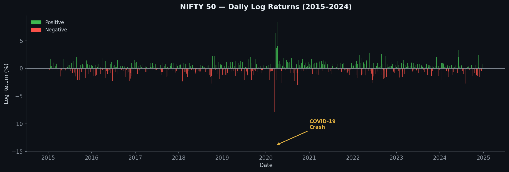
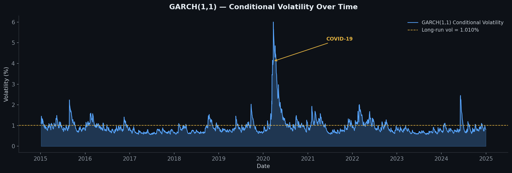
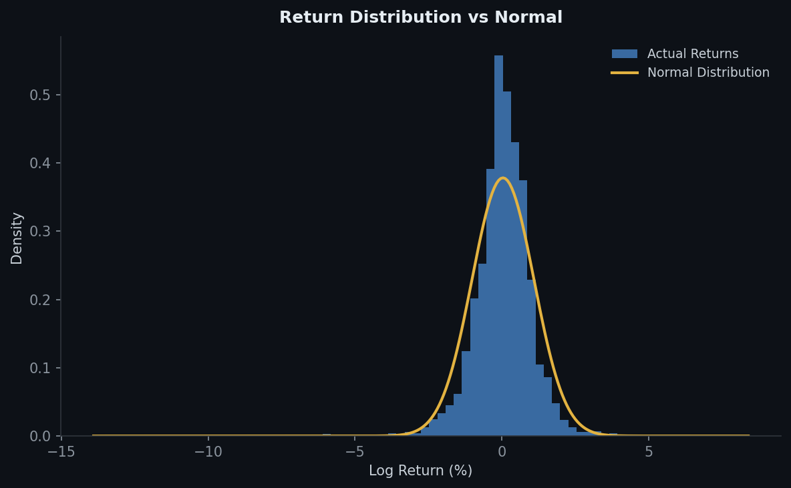
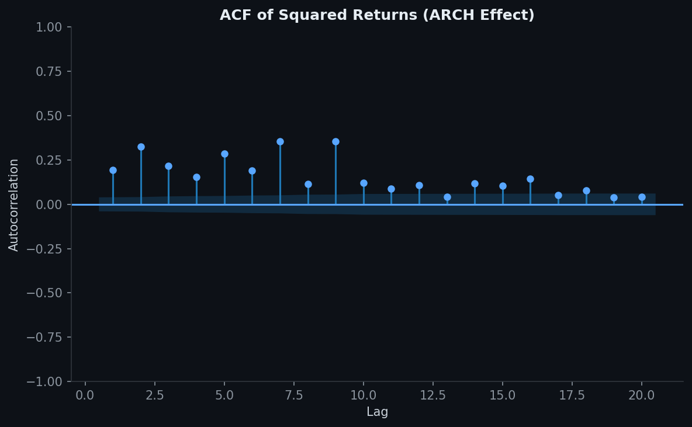
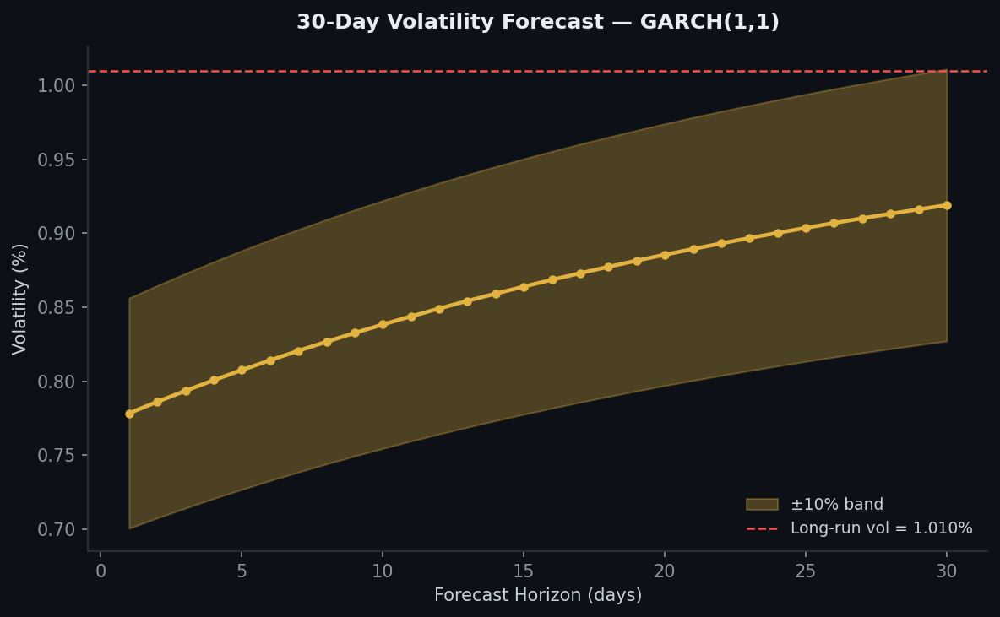
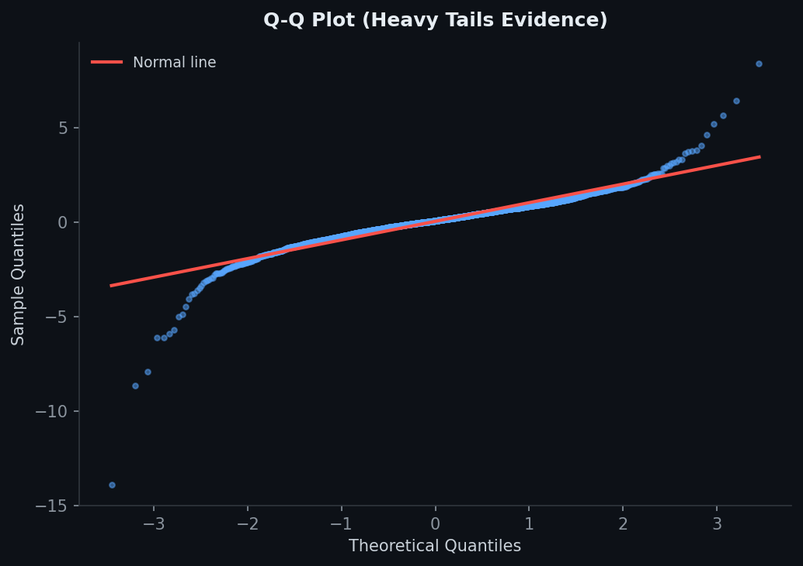

# NIFTY 50 — Volatility Analysis using ARCH/GARCH Models (2015–2024)


---

## Project Overview

This project models the **volatility of India's NIFTY 50 stock index** using **ARCH** and **GARCH** models on daily log return data spanning **10 years (2015–2024)** — a period covering bull markets, election cycles, the COVID-19 crash and recovery.

Financial returns exhibit well-known stylised facts — **volatility clustering**, **heavy tails**, and **non-normality** — that standard OLS cannot capture. This project applies the **ARCH/GARCH framework** to quantify and forecast that time-varying volatility.

---

## Objectives

- Compute and analyse daily log returns of NIFTY 50 (2015–2024)
- Test for ARCH effects using **Engle's LM Test**
- Fit and compare **ARCH(1)** and **GARCH(1,1)** models
- Interpret key model parameters (ω, α, β) and their economic meaning
- Produce a **30-day volatility forecast**
- Visualise findings with publication-quality charts

---

## The Models

### ARCH(1) — AutoRegressive Conditional Heteroskedasticity

$$\sigma_t^2 = \omega + \alpha_1 \varepsilon_{t-1}^2$$

Volatility depends only on last period's shock. Simple but limited — it cannot capture long-range volatility persistence.

---

### GARCH(1,1) — Generalised ARCH *(preferred model)*

$$\sigma_t^2 = \omega + \alpha_1 \varepsilon_{t-1}^2 + \beta_1 \sigma_{t-1}^2$$

| Parameter | Symbol | Interpretation |
|-----------|--------|----------------|
| Constant | ω (omega) | Baseline long-run variance |
| ARCH term | α (alpha) | Sensitivity to recent shocks |
| GARCH term | β (beta) | Volatility persistence from previous period |
| Persistence | α + β | Total persistence; < 1 means mean-reverting |

> Mean-reverting (α + β < 1) means volatility shocks eventually decay back to the long-run level.

---

## Dataset

| Detail | Value |
|--------|-------|
| Index | NIFTY 50 (^NSEI) |
| Source | Yahoo Finance via `yfinance` |
| Period | January 2015 – December 2024 |
| Frequency | Daily |
| Observations | 2,458 trading days |
| Variable Used | Log Returns = ln(Pₜ / Pₜ₋₁) |

### Descriptive Statistics

| Statistic | Value |
|-----------|-------|
| Mean Return | 0.0421% |
| Std Deviation | 1.0545% |
| Min Return | −13.90% (COVID-19 crash) |
| Max Return | +8.40% |
| Skewness | −1.41 (left-skewed) |
| Excess Kurtosis | 20.41 (heavy tails) |

> **High kurtosis and negative skewness** confirm that NIFTY 50 returns are **non-normal** — consistent with financial theory and justifying GARCH modelling.

---

## ARCH LM Test

Before fitting GARCH, we formally test for the presence of ARCH effects:

| Test | Value |
|------|-------|
| Test Statistic | 639.05 |
| p-value | 7.52 × 10⁻¹³¹ |
| Conclusion | **presence of ARCH effect** — GARCH modelling is justified |

---

## Model Results

### ARCH(1)

| Parameter | Coefficient | Std Error | t-stat | p-value |
|-----------|-------------|-----------|--------|---------|
| μ (mean) | 0.0634 | 0.0214 | 2.96 | 0.003 |
| ω (omega) | 0.7181 | 0.0624 | 11.50 | < 0.001 |
| α[1] | 0.3162 | 0.0652 | 4.85 | < 0.001 |

**Log-Likelihood: −3393.66 | AIC: 6793.31 | BIC: 6810.73**

---

### GARCH(1,1) referred

| Parameter | Coefficient | Std Error | t-stat | p-value | Interpretation |
|-----------|-------------|-----------|--------|---------|----------------|
| μ (mean) | 0.0720 | 0.0176 | 4.10 | < 0.001 | Daily mean return |
| ω (omega) | 0.0298 | 0.0104 | 2.86 | 0.004 | Long-run variance floor |
| α[1] | 0.1100 | 0.0263 | 4.18 | < 0.001 | Shock sensitivity |
| β[1] | 0.8609 | 0.0304 | 28.28 | < 0.001 | Volatility persistence |

**Log-Likelihood: −3193.11 | AIC: 6394.22 | BIC: 6417.45**

---

## Model Comparison

| Model | Log-Likelihood | AIC | BIC |
|-------|---------------|-----|-----|
| ARCH(1) | −3393.66 | 6793.31 | 6810.73 |
| **GARCH(1,1)** | **−3193.11** | **6394.22** | **6417.45** |

*GARCH(1,1) wins** — lower AIC and BIC confirm it is the better fit.

---

## Key Findings

### 1. Volatility Clustering
The GARCH conditional volatility chart shows volatility bunching — calm periods are followed by calm, turbulent periods by turbulence. The COVID-19 crash (March 2020) caused an extreme volatility spike (>6%), followed by gradual mean-reversion.

### 2. High Persistence (α + β = 0.9708)
With persistence close to 1, NIFTY 50 volatility shocks are **long-lasting**. A shock today will still be influencing volatility weeks later.

### 3. Asymmetry & Heavy Tails
Kurtosis of 20.41 and negative skewness confirm **fat-tailed, left-skewed** returns — extreme negative returns (crashes) occur far more often than a normal distribution would predict.

### 4. Mean Reversion
Since α + β = 0.9708 < 1, volatility is **mean-reverting** toward a long-run level of **~1.01% per day**, ensuring the model is stationary.

### 5. 30-Day Forecast
The GARCH(1,1) forecast shows volatility **reverting toward 1.01%** from current elevated levels, with the ±10% forecast band widening over the horizon — reflecting increasing uncertainty further out.

---

## Visualisations

### Daily Log Returns


### GARCH(1,1) Conditional Volatility


### Return Distribution vs Normal


### ACF of Squared Returns (ARCH Effect)


### 30-Day Volatility Forecast


### Q-Q Plot (Heavy Tails)


---

## Limitations

### 1. Normal Distribution Assumption
The base GARCH(1,1) model assumes normally distributed errors. Given the extreme kurtosis (20.41), a **Student's t-distribution** or **GJR-GARCH** (which captures asymmetry) would likely provide better tail modelling.

### 2. No Leverage Effect
Standard GARCH treats positive and negative shocks equally. In equity markets, negative shocks typically increase volatility more — the **EGARCH** or **GJR-GARCH** models address this asymmetry.

### 3. Univariate Model
This is a single-asset analysis. In practice, portfolio risk management requires **multivariate GARCH** models (DCC-GARCH, BEKK-GARCH) to capture cross-asset correlation dynamics.

### 4. Structural Breaks
The COVID-19 period (2020) is an extreme structural break. A **Markov-Switching GARCH** or regime-detection approach could better handle such extraordinary events.

---

## Future Scope

| Extension | Description |
|-----------|-------------|
| **GJR-GARCH** | Capture leverage effect (asymmetric response to shocks) |
| **EGARCH** | Exponential GARCH — models log variance, no positivity constraint |
| **t-GARCH** | Student-t errors for better heavy-tail modelling |
| **DCC-GARCH** | Dynamic Conditional Correlation across multiple indices |
| **Intraday GARCH** | Use high-frequency tick data for intraday volatility analysis |
| **VaR Backtesting** | Use GARCH forecasts for Value-at-Risk risk management |

---

## Repository Structure

```
nifty50-garch-volatility/
├── README.md                                   # Project overview & findings
├── NIFTY_50_final_dataset.csv                  # Dataset (2015–2024, daily)
├── garch_analysis.py                           # Full Python ARCH/GARCH script
├── Volatility_Analysis_using_ARCH_GARCH.ipynb  # Jupyter notebook
└── charts/
    ├── chart1_log_returns.png                  # Daily log returns bar chart
    ├── chart2_garch_volatility.png             # GARCH conditional volatility
    ├── chart3_distribution.png                 # Return distribution vs Normal
    ├── chart4_acf_squared.png                  # ACF of squared returns
    ├── chart5_forecast.png                     # 30-day volatility forecast
    └── chart6_qq_plot.png                      # Q-Q plot (heavy tails)
```

---

## Tools & Libraries

- **Python** — pandas, numpy, scipy, matplotlib
- **arch** — ARCH/GARCH model estimation
- **statsmodels** — ARCH LM test, ACF plots
- **yfinance** — NIFTY 50 data download

---

## References

- Engle, R.F. (1982). *Autoregressive Conditional Heteroscedasticity with Estimates of the Variance of United Kingdom Inflation*. Econometrica, 50(4), 987–1007.
- Bollerslev, T. (1986). *Generalized Autoregressive Conditional Heteroskedasticity*. Journal of Econometrics, 31(3), 307–327.
- Tsay, R.S. (2010). *Analysis of Financial Time Series*. Wiley.
- Yahoo Finance — NIFTY 50 Historical Data (^NSEI)

---

## Author

**[Swayam Gupta]**
Aspiring Data Analyst | [https://www.linkedin.com/in/swayam-gupta-2a7174251/] | [swayamg27@gmail.com]
Python · Excel · SQL · Econometrics · Financial Modelling · Forecasting method for Finance · Risk Forecasting · Time Series Modelling

> *"Volatility is the price you pay for performance."* — Financial Wisdom
